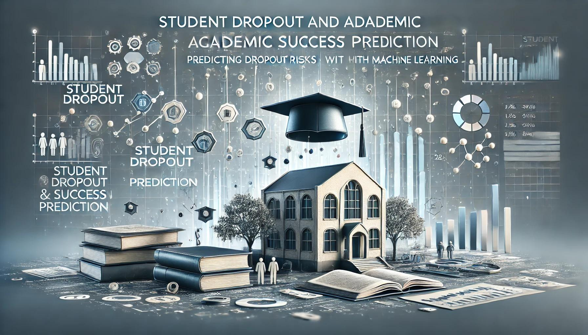
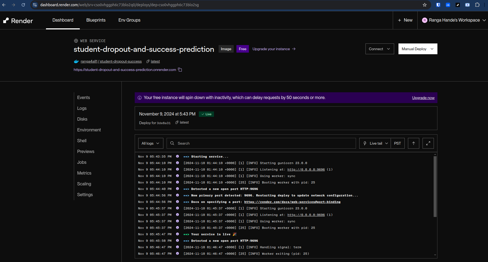
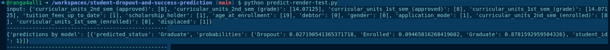

# Table of Contents

- [Student Dropout and Academic Success Prediction](#student-dropout-and-academic-success-prediction)
  - [System Overview](#system-overview)
  - [Technical Architecture](#technical-architecture)
  - [Data Specification](#data-specification)
  - [Technical Stack](#technical-stack)
  - [Implementation Guide (Reproduce)](#implementation-guide-reproduce)
  - [Repository Structure](#repository-structure)
  - [Development Environment Configuration](#development-environment-configuration)
  - [Model Development and Analysis](#model-development-and-analysis)
  - [Source Code](#source-code)
  - [Model Training and Local Testing](#model-training-and-local-testing)
  - [API Service Implementation](#api-service-implementation)
  - [Production Deployment with Gunicorn](#production-deployment-with-gunicorn)
  - [Docker Implementation (Containerization)](#docker-implementation-containerization)
  - [Cloud Infrastructure Deployment](#cloud-infrastructure-deployment)
  - [Bonus: Podcast](#bonus-podcast)


# Student Dropout and Academic Success Prediction

A Flask-based REST API that predicts student dropout probability and academic performance using machine learning. This service analyzes various student attributes to provide insights into academic outcomes and retention risks.




## System Overview

Student dropout and academic underperformance are significant challenges in higher education institutions, impacting both the students' futures and institutional effectiveness. Early identification of at-risk students is crucial for implementing timely interventions and support systems.

This project addresses these challenges by developing a **machine learning model that predicts both student dropout probability and academic performance**. The model analyzes various demographic, social, economic, and academic factors to generate accurate predictions.

By leveraging historical student data and advanced analytics, institutions can proactively identify students who may need additional support, enabling targeted interventions before academic issues become critical.

The solution provides a **REST API interface** that allows educational institutions to easily integrate these predictive capabilities into their existing student management systems, making it practical for real-world applications.

The model considers multiple factors including enrollment data, academic performance, socio-economic indicators, and previous educational background to provide comprehensive insights into student success patterns.

## Technical Architecture

#### What Does the Student Success Predictor Do?

The **Student Success Predictor** uses classical machine learning techniques to predict student dropout probability and academic performance. Key aspects include:

- **Multiple Model Evaluation**: The project evaluated several classical ML models including:
  - Logistic Regression
  - Decision Trees
  - Random Forest
  - XGBoost

- **Model Selection**: After comprehensive testing and validation, **Random Forest** was selected as the final model due to its:
  - Superior prediction ROC-AUC
  - Ability to handle both numerical and categorical features
  - Robustness against overfitting
  - Feature importance insights

- **Feature Engineering**: The model processes various types of input data:
  - Demographic information (age, gender, nationality)
  - Academic history (previous qualifications, first semester performance)
  - Socio-economic indicators (parent's education, scholarship status)
  - Enrollment details (course type, attendance mode)

- **Practical Implementation**: The system provides:
  - Multiclass classification
  - REST API for easy integration with existing systems
  - Real-time predictions for individual students
  - Batch processing capabilities for institutional-level analysis
  - Feature importance analysis for understanding key dropout factors


Sample prediction from our Flask-based REST API service:

```
input: {'curricular_units_2nd_sem_(approved)': [8], 'curricular_units_2nd_sem_(grade)': [14.07125], 'curricular_units_1st_sem_(approved)': [8], 'curricular_units_1st_sem_(grade)': [14.07125], 'tuition_fees_up_to_date': [1], 'scholarship_holder': [1], 'age_at_enrollment': [19], 'debtor': [0], 'gender': [0], 'application_mode': [1], 'curricular_units_2nd_sem_(enrolled)': [8], 'curricular_units_1st_sem_(enrolled)': [8], 'displaced': [1]}
--------------------------------------------------
{'predictions by model': [{'predicted_status': 'Graduate', 'probabilities': {'Dropout': 0.027190541365371718, 'Enrolled': 0.09465016268419602, 'Graduate': 0.8781592959504326}, 'student_id': 1}]}
--------------------------------------------------
```

## Data Specification

The dataset was sourced from:
1. [**UCI**](https://archive.ics.uci.edu/dataset/697/predict+students+dropout+and+academic+success)
2. [**Kaggle**](https://www.kaggle.com/datasets/thedevastator/higher-education-predictors-of-student-retention/data)


You can find data in [**`data/dataset.csv`**](data/dataset.csv)

**Columns:**

| Column Name | Description |
|------------|-------------|
| Marital status | The marital status of the student. (Categorical) |
| Application mode | The method of application used by the student. (Categorical) |
| Application order | The order in which the student applied. (Numerical) |
| Course | The course taken by the student. (Categorical) |
| Daytime/evening attendance | Whether the student attends classes during the day or in the evening. (Categorical) |
| Previous qualification | The qualification obtained by the student before enrolling in higher education. (Categorical) |
| Nationality | The nationality of the student. (Categorical) |
| Mother's qualification | The qualification of the student's mother. (Categorical) |
| Father's qualification | The qualification of the student's father. (Categorical) |
| Mother's occupation | The occupation of the student's mother. (Categorical) |
| Father's occupation | The occupation of the student's father. (Categorical) |
| Displaced | Whether the student is a displaced person. (Categorical) |
| Educational special needs | Whether the student has any special educational needs. (Categorical) |
| Debtor | Whether the student is a debtor. (Categorical) |
| Tuition fees up to date | Whether the student's tuition fees are up to date. (Categorical) |
| Gender | The gender of the student. (Categorical) |
| Scholarship holder | Whether the student is a scholarship holder. (Categorical) |
| Age at enrollment | The age of the student at the time of enrollment. (Numerical) |
| International | Whether the student is an international student. (Categorical) |
| Curricular units 1st sem (credited) | The number of curricular units credited by the student in the first semester. (Numerical) |
| Curricular units 1st sem (enrolled) | The number of curricular units enrolled by the student in the first semester. (Numerical) |
| Curricular units 1st sem (evaluations) | The number of curricular units evaluated by the student in the first semester. (Numerical) |
| Curricular units 1st sem (approved) | The number of curricular units approved by the student in the first semester. (Numerical) |


## Technical Stack

- **`Python 3.12`**
- **`JupyterLab`** for experimentation
- **`scikit-learn`** for machine learning model development
- **`flask`** for REST API interface
- **`Pipenv`** for virtual env (managing python dependencies)
- **`Docker`** for containerization (managing system dependencies)
- **`Render`** for cloud deployment


## Implementation guide (Reproduce)

Simplest way to run this application:

1. Clone this repository:
```
git clone https://github.com/ranga4all1/student-dropout-and-success-prediction
```
2. Follow steps in [**`Docker Implementation (Containerization)`**](#docker-implementation-containerization) section to build and test.


## Repository Structure

```
.
├── data
│   └── dataset.csv
├── notebooks
│   ├── model-train.ipynb
│   ├── model_rf.bin
│   └── notebook.ipynb
├── Dockerfile
├── LICENSE
├── Pipfile
├── Pipfile.lock
├── README.md
├── model_rf.bin
├── predict-local-test.py
├── predict-requests-test.py
├── predict.py
└── train.py
```

## Development Environment Configuration

1. GitHub:
    - Create repo:`student-dropout-and-success-prediction`
    - Start codespace and connect to it from your IDE e. g. VS Code

    **Note**: You can use your local system or any cloud VM + your favorite editor

2. For dependency management, we use pipenv during experimentation, so you need to install it

- install pipenv:
```
pip install pipenv
```

- Once installed, you can install the app dependencies:
```
pipenv install ipykernel pandas scikit-learn xgboost tqdm flask gunicorn

pipenv install --dev notebook ipywidgets matplotlib seaborn
```

- Map kernel:
```
pipenv run python -m ipykernel install --user --name=student-dropout-and-success-prediction --display-name "Python (student-dropout-and-success-prediction)"
```

- Run jupyter-lab:
```
pipenv run jupyter-lab
```

**Note**: Make sure to select mapped kernel in jupyter-lab before executing notebooks.


## Model Development and Analysis

For experiments, we use Jupyter notebooks. They are in the [**`notebooks`**](notebooks/) folder.

We have the following notebooks:

- [**`notebook.ipynb`**](notebooks/notebook.ipynb)

    - Data load
    - Data preparation
    - EDA (Exploratory Data Analysis)
        - Statistical summaries
        - Distribution analysis
        - Correlation studies
        - Missing value analysis
    - Feature engineering
        - Feature scaling
        - Encoding categorical variables, if needed
        - Feature selection
        - Handling missing values, if needed
    - Feature selection
        - Correlation analysis
        - Feature importance
    - Model development
        - Data splitting (train/validation/test)
        - Training multiple models
        - Hyperparameter tuning
        - Model evaluation
            - Performance metrics
            - ROC-AUC analysis
            - Confusion matrix
        - Model selection


- [**`model-train.ipynb`**](notebooks/model-train.ipynb)
    - Final Model development
        - Data splitting (train/validation/test)
        - handling class imbalence
        - Training selected Model
        - Cross-validation
        - Train final model with train+val data

    - Model save/load
        - Pickle model and scaler in a single file
        - Load and test saved model

## Source Code

After experimentation, application scripts were developed. We have below code files:

- [**`train.py`**](train.py) - Train and save model
- [**`predict.py`**](predict.py) - Flask API endpoint for model predictions
- [**`predict-local-test.py`**](predict-local-test.py) - Test saved model locally with sample data
- [**`predict-requests-test.py`**](predict-requests-test.py) - Test Flask API endpoint with sample requests
- [**`predict-render-test.py`**](predict-render-test.py) - Test Render cloud's Flask API endpoint web service with sample requests
- [**`Dockerfile`**](Dockerfile) - Docker configuration for containerizing the prediction service


## Model Training and Local Testing

1. Train and save model

```
pipenv run python train.py
```
Result:
```
Importing required libraries...
Loading data...
Pre-processing data...
Performing train-val-test split...
Scaling data...
handling class imbalance...
--------------------------------------------------
Training model without cross-validation...

ROC-AUC score: 0.8661
--------------------------------------------------
Training model with cross-validation...

Cross-validation results:
Mean ROC-AUC: 0.8763 ± 0.0193
Individual fold scores: 0.8813, 0.8819, 0.8567, 0.8825, 0.8792
--------------------------------------------------
Training final model using train+val...

ROC-AUC score: 0.8843
--------------------------------------------------
Saving model...
All steps completed!
--------------------------------------------------
```

2. Load saved model and test

```
pipenv run python predict-local-test.py
```

Result:
```
Importing required libraries...
Loading model...
input: {'curricular_units_2nd_sem_(approved)': [8], 'curricular_units_2nd_sem_(grade)': [14.07125], 'curricular_units_1st_sem_(approved)': [8], 'curricular_units_1st_sem_(grade)': [14.07125], 'tuition_fees_up_to_date': [1], 'scholarship_holder': [1], 'age_at_enrollment': [19], 'debtor': [0], 'gender': [0], 'application_mode': [1], 'curricular_units_2nd_sem_(enrolled)': [8], 'curricular_units_1st_sem_(enrolled)': [8], 'displaced': [1]}
--------------------------------------------------
Student 1: Prediction = Graduate, Probabilities = [0.02719054 0.09465016 0.8781593 ]
```

## API Service Implementation

```
pipenv run python predict.py
```

#### Testing From another terminal, run:
```
pipenv run python predict-requests-test.py
```

Result:
```
input: {'curricular_units_2nd_sem_(approved)': [8], 'curricular_units_2nd_sem_(grade)': [14.07125], 'curricular_units_1st_sem_(approved)': [8], 'curricular_units_1st_sem_(grade)': [14.07125], 'tuition_fees_up_to_date': [1], 'scholarship_holder': [1], 'age_at_enrollment': [19], 'debtor': [0], 'gender': [0], 'application_mode': [1], 'curricular_units_2nd_sem_(enrolled)': [8], 'curricular_units_1st_sem_(enrolled)': [8], 'displaced': [1]}
--------------------------------------------------
{'predictions by model': [{'predicted_status': 'Graduate', 'probabilities': {'Dropout': 0.027190541365371718, 'Enrolled': 0.09465016268419602, 'Graduate': 0.8781592959504326}, 'student_id': 1}]}
```

## Production Deployment with Gunicorn
```
pipenv shell
gunicorn --bind 0.0.0.0:9696 predict:app
```
OR
```
pipenv run gunicorn --bind 0.0.0.0:9696 predict:app
```

#### Testing From another terminal, run:
```
pipenv run python predict-requests-test.py
```

Result: Same as previous step


## Docker Implementation (Containerization)

1. Build and run docker image (for system dependency management)

```
docker build -t <your_dockerhub_username>/student-dropout-success .
docker images
```
**Note**: We are adding `<your_dockerhub_username>` in the name to push image to docker HUB later. Refer to [Cloud Infrastructure Deployment](#cloud-infrastructure-deployment) section for more details.

2. Run the container with proper signal handling
```
docker run -it --rm \
  --name student-dropout-container \
  -p 9696:9696 \
  --stop-signal SIGTERM \
  --stop-timeout 30 \
  <your_dockerhub_username>/student-dropout-success
```
You can stop the container gracefully by:

- Using Ctrl+C if running in interactive mode
- Running `docker stop student-dropout-container` from another terminal

3. Test from another terminal

```
python predict-requests-test.py
```
Result: Same as previous step


## Cloud Infrastructure Deployment

We will be deploying to Render cloud.

#### Docker HUB: Create an image repository

1. Go to [**`Docker Hub`**](https://hub.docker.com) and sign in by creating account.
2. Select Create repository.
3. On the Create repository page, enter the following information:
  - Repository name - `student-dropout-success`
  - Short description - Flask based REST API service for student-dropout-success-prediction
  - Visibility - select `Public` to allow others to pull your app
4. Select Create to create the repository.
5. Go to your docker hub account settings -> Personal access tokens and create access token:
  - description: my-access-token
  - permissions: Read & Write

#### Push docker image to docker hub

```
docker login -u <your_dockerhub_username> -p <your_access_token>
docker push <your_dockerhub_username>/student-dropout-success:latest
```

#### Deploy to `Render` cloud service

1. In the [**`Render Dashboard`**](https://dashboard.render.com/), sign in (create account if needed) and click `+ New` -> `Web service`
- Source Code: Existing Image
- Image URL: `<your_dockerhub_username>/student-dropout-success`
- Name: `student-dropout-and-success-prediction`
- Region: `<your-nearest-region>`
- Instance type: `Free`
2. Click -> Deploy web service. Wait till service starts successfully.
3. Note down your web service URL



#### Test cloud based service

1. Update `predict-render-test.py` with you URL in this format: `url = "https://<your-render-url>/predict"`
2. Test
```
python predict-render-test.py
```
Result:
```
@ranga4all1 ➜ /workspaces/student-dropout-and-success-prediction (main) $ python predict-render-test.py
input: {'curricular_units_2nd_sem_(approved)': [8], 'curricular_units_2nd_sem_(grade)': [14.07125], 'curricular_units_1st_sem_(approved)': [8], 'curricular_units_1st_sem_(grade)': [14.07125], 'tuition_fees_up_to_date': [1], 'scholarship_holder': [1], 'age_at_enrollment': [19], 'debtor': [0], 'gender': [0], 'application_mode': [1], 'curricular_units_2nd_sem_(enrolled)': [8], 'curricular_units_1st_sem_(enrolled)': [8], 'displaced': [1]}
--------------------------------------------------
{'predictions by model': [{'predicted_status': 'Graduate', 'probabilities': {'Dropout': 0.027190541365371718, 'Enrolled': 0.09465016268419602, 'Graduate': 0.8781592959504326}, 'student_id': 1}]}
--------------------------------------------------
```



#### Shut down web service

Once tested, remove web service to avoid charges, if any.

1. In the [**`Render Dashboard`**](https://dashboard.render.com/), Click -> Dashboard
2. Click the `[...]` (three-dot) button next to your web service that was deployed earlier
3. Click `Settings`
4. Click `Delete Web Service` at the **end** of the page
5. Copy the delete command and validate to remove service


## Bonus: Podcast

Join us for an insightful discussion on predicting student success using machine learning. Our podcast explores how data-driven approaches can revolutionize student retention strategies in higher education. Listen as we break down the technical implementation of our Random Forest model and its real-world impact on helping institutions identify at-risk students early.

[Spotify podcast](https://open.spotify.com/show/6MOWOQgC3e4UJHuQP5J4Wf)

*This podcast was auto-generated using [NotebookLM](https://notebooklm.google/)*


